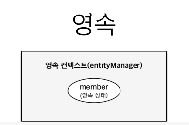
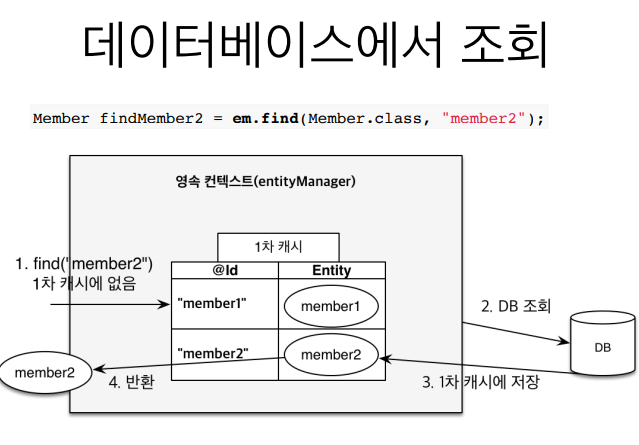

# 영속성 관리
* **

## 영속성 컨텍스트

+ 엔티티를 영구 저장하는 환경
+ 엔티티 매니저를 통해서 접근


### persist(entity) 메소드

```DB```에 저장하는 것이 아니라.entity를 ```영속성 컨텍스트```에 저장한다.


## 엔티티 생명주기

+ 비영속 : 영속성 컨텍스트와 전혀 관계가 없는 새로운 상태


```java
//객체를 생성한 상태(비영속)
Member member = new Member();
member.setId("member1");
member.setUsername("회원1");
```

+ 영속 : 영속성 컨텍스트에 관리되는 상태

```java
//객체를 저장한 상태(영속)
em.persist(member);
```
+ 준영속 : 영속성 컨텍스트에 저장되었다가 분리된 상태

```java
//영속성 컨텍스트에서 분리(준영속)
em.detach(member);
```
+ 삭제 : 삭제된 상태
```java
//객체를 삭제한 상태(삭제)
em.remove(member);
```

## 영속성 컨텍스트의 이점


### 1차캐시
```
 key:DB의 pk로 매핑한 값(@Id) , value: 객체
```


em.find로 조회 하게 되면 JPA 는 ```DB```를 조회하는 것이 아닌 ```1차 캐시```를 먼저 조회한다.  
이때 1차 캐시에 같은 key 값이 존재하면 캐시에 있는 ```entity```를 그대로 반환 한다.

### 그렇다면 1차 캐시에 없는 entity는 어떻게 조회하지?


다음과 같이 영속성 컨텍스트에 찾는 ```entity```가 없다면 ```DB```를 조회한다  
그 다음에 조회해온 ```entity``` 를 ```1차 캐시```에 저장한다 그리고 찾아온 ```entity```를 반환한다.


