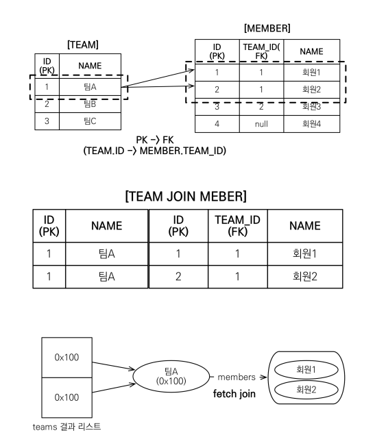
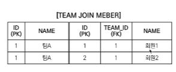
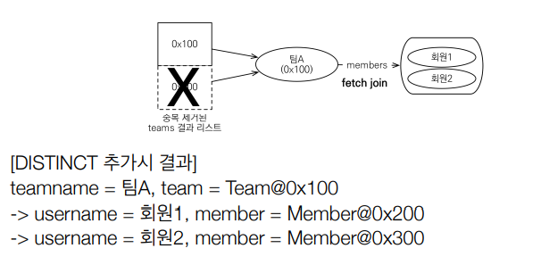
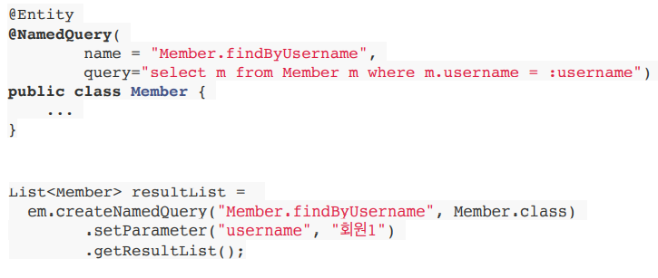

## 경로 표현식

` . 점을 찍어 객체 그래프를 탐색하는 것`


```java
select m.username -> 상태필드
        from Member m
        join m.team t -> 단일 값 연관 필드
        join m.orders o -> 컬렉션 값 연관 필드
where t.name = '팀A'
```

상태 필드(state field) :단순히 값을 저장하기 위한 필드

+ 연관 필드(association filed):연관관계를 위한 필드
    + 단일 값 연관 필드: @ManyToOne, @OneToOne, 대상이 엔티티 (m.team)
    + 컬렉션 값 연관 필드: @ManyToMany, 대상이 컬렉션 (m.orders)

    

### 경로 표현식 특징

+ 상태 필드: 경로 탐색의 끝이다,더이상 탐색x (username 에서 . 을 찍어서 더이상 갈 수가없음)

```sql
JPQL: select m.username, m.age from Member m 
SQL: select m.username, m.age from Member m
```

+ 단일 값 연관 경로: 묵시적 내부 조인(inner join) 발생한다, 탐색O
  + 쿼리문에 inner join이 발생,쿼리 튜닝이 어려움,묵시적으로 쿼리가 나가도록 코드를 짜는것을 지양해야한다.
```sql
JPQL: select o.member from Order o 
SQL:
    select m.* 
        from Orders o 
        inner join Member m on o.member_id = m.id
```


+ 컬렉션 값 연관 경로: 묵시적 내부 조인 발생 , 탐색X
    + 일대다인경우 컬렉션에서 어떤 것을 선택해서 어떤 필드를 가져오는지 모르기때문에 
    난감한 상황이 일어난다.
    + FROM 절에서 명시적 조인을 통해 별칭을 얻으면 별칭을 통해 탐색이 가능하다. `FROM t.member m`
  

> 묵시적 조인 사용X , 명시적 조인을 사용해야 쿼리 튜닝이 편함

-- --

### 명시적 조인과 묵시적 조인
+ 명시적 조인: join 키워드 직접 사용
  + select m from Member m join m.team t
<br><br>
+ 묵시적 조인: 경로 표현식에 의해 묵시적으로 SQL 조인 발생 (내부 조인만 가능)
  + select m.team from Member m


### 경로 표현식 - 예제

```sql
select o.member.team from Order o -> 성공
```
조인이 두번 일어남 , sql을 상상하기가 어려움

```sql 
select t.members from Team -> 성공
```

```sql
select t.members.username from Team t -> 실패
```
컬렉션에서는 더이상 탐색이 불가능하기 때문에 실패, .size정도는 가능 

```sql
select m.username from Team t join t.members m -> 성공
```
컬렉션을 명시적 조인하여 별칭을 가져왔기 때문에 m에서 다시 시작했으므로 username을 가져오는데 성공

### 경로 탐색을 사용한 묵시적 조인 시 주의사항
+ 항상 내부 조인
+ 컬렉션은 경로 탐색의 끝, 명시적 조인을 통해 별칭을 얻어야함
+ 경로 탐색은 주로 SELECT, WHERE 절에서 사용하지만 묵시적 조인으로 인해 SQL의 FROM (JOIN) 절에 영향을 줌

### 실무조언 
> + 가급적 묵시적 조인 대신에 명시적 조인 사용!
> + 조인은 SQL 튜닝에 중요 포인트
> + 묵시적 조인은 조인이 일어나는 상황을 한눈에 파악하기 어려움


## 페치 조인(fetch join)
> 실무에서 정말 중요하다!

+ SQL 조인 종류X
+ JPQL에서 성능 최적화를 위해 제공하는 기능
+ 연관된 엔티티나 컬렉션을 SQL 한 번에 함께 조회하는 기능 (쿼리 두번 나갈거 같을때 한방 쿼리로 풀어낼 수 있는 기능)
+ join fetch 명령어 사용
+ 페치 조인 ::= [ LEFT [OUTER] | INNER ] JOIN FETCH 조인경로


### 엔티티 페치 조인 
+ 회원을 조회하면서 연관된 팀도 함께 조회(SQL 한 번에)
+ SQL을 보면 회원 뿐만 아니라 팀(T.*)도 함께 SELECT
+ 
```sql
[JPQL] select m from Member m (join fetc) m.team
```
```sql
[SQL] SELECT M.*, T.* FROM MEMBER M INNER JOIN TEAM T ON M.TEAM_ID=T.ID

멤버와 팀의 데이터를 다 나열하고 조인을 건다.즉시로딩 하는것과 sql문이 유사 
```

### 페치 조인 사용 코드


### 다대일 관계 페치 조인

- 페치조인 사용x
```java
String jpql = "select m from Member m"; 
List<Member> members = em.createQuery(jpql, Member.class)
        .getResultList(); 

for (Member member : members) {
 System.out.println("username = " + member.getUsername() + ", " +"teamName = " + member.getTeam().name());  //getTeam
 // 회원1, 팀A(SQL 쿼리로 가져옴)
 // 회원2, 팀A(1차 캐시 , 팀A가 영속성 컨텍스트에 있으므로)
 // 회원3, 팀B(SQL)      
 // 쿼리가 3번 나간 모습을 볼 수 있음.    
 
 // 회원 100명 -> N + 1 문제 (1은 회원을 가져오기 위한 쿼리)        
} 
```

- 페치조인 사용
```java
String jpql = "select m from Member m join fetch m.team";
List<Member> members = em.createQuery(jpql, Member.class)
        .getResultList();  
//team 은 프록시가 아니라 실제 엔티티가 담긴다.
//영속성 컨텍스트에 이미 데이터가 올라가 있다.
        
for (Member member : members) {
   //페치 조인으로 회원과 팀을 함께 조회해서 지연 로딩X
   System.out.println("username = " + member.getUsername() + ", " +"teamName = " + member.getTeam().name());
}
```

### 컬렉션 페치 조인 
+ 일대다 관계, 컬렉션 페치 조인
+ 
```
String jpql = "select t from Team t join fetch t.members where t.name = '팀A'" 
List<Team> teams = em.createQuery(jpql, Team.class).getResultList(); 

for(Team team : teams) { 
 System.out.println("teamname = " + team.getName() + ", team = " + team); 
 for (Member member : team.getMembers()) { 
 //페치 조인으로 팀과 회원을 함께 조회해서 지연 로딩 발생 안함
 System.out.println(“-> username = " + member.getUsername()+ ", member = " + member); 
 } 
}

출력:
teamname = 팀A, team = Team@0x100 
-> username = 회원1, member = Member@0x200 
-> username = 회원2, member = Member@0x300 
teamname = 팀A, team = Team@0x100 
-> username = 회원1, member = Member@0x200 
-> username = 회원2, member = Member@0x300 
```
  
`Team`은 하나고 `Member` 가 여러개인 일대다관계이기 때문에 조인을 하게되면 데이터가 뻥튀기되어서 `TeamA` 값이 여러개 찍히게 된다.


중복이 싫은데 어떡하지? DISTINCT로 제거하면 된다.
-- --
### 페치 조인과 DISTINCT

+ SQL의 DISTINCT는 중복된 결과를 제거하는 명령 (SQL의 DISTINCT 만으로는 중복을 모두 제거 불가능)

+ JPQL의 DISTINCT 2가지 기능 제공
  + 1.SQL에 DISTINCT를 추가
  + 2.애플리케이션에서 엔티티 중복 제거

+ sql에 추가
```sql
select distinct t from Team t join fetch t.members where t.name = ‘팀A’
```

> SQL에 DISTINCT를 추가하지만 데이터가 다르므로(ID,NAME) SQL 결과 에서 중복제거 실패


+ JPA에서 DISTINCT가 추가로 애플리케이션에서 중복 제거시도
+ 같은 식별자를 가진 Team 엔티티 제거



### 페치 조인과 일반 조인의 차이 
+ 페치 조인은 연관된 엔티티를 함께 조회함
+ 일반 조인 예시
```java
  [JPQL] select t from Team t join t.members where t.name = ‘팀A'
        
  [SQL]
  SELECT T.* FROM TEAM T  INNER JOIN MEMBER M ON T.ID=M.TEAM_ID  WHERE T.NAME = '팀A'
```
>일반 조인 하게되면 팀에 대한 정보만 퍼올리게 된다.

+ JPQL은 결과를 반환할 때 연관관계 고려X
+ 단지 SELECT 절에 지정한 엔티티만 조회할 뿐
+ 여기서는 팀 엔티티만 조회하고, 회원 엔티티는 조회X
+ 페치 조인을 사용할 때만 연관된 엔티티도 함께 조회(즉시 로딩)
+ 페치 조인은 객체 그래프를 SQL 한번에 조회하는 개념
+ 페치 조인 예시
```java 
[JPQL] select t from Team t join fetch t.members where t.name = ‘팀A'

[SQL]
SELECT T.*,M.* FROM TEAM T  INNER JOIN MEMBER M ON T.ID=M.TEAM_ID  WHERE T.NAME = '팀A'
```

### 페치 조인의 특징과 한계

+ 페치 조인 대상에는 별칭을 줄 수 없다.
  + select t From Team t  join Fetch t.members `as m`  <- 연관관계가 걸린 경우 데이터가 누락될 수 있음 
  + 하이버네이트는 가능 , 가급적 사용 x
  + 객체 그래프 탐색은 기본적으로 데이터를 다 조회하는 것
  + 원하는 만큼의 데이터(3개,5개) 를 가져오고 싶으면 쿼리를 따로 날려야 한다.
  + 잘못하면 나머지 데이터가 지워질 위험이 있기 때문에
  
+ 둘 이상의 컬렉션은 페치 조인 할 수 없다.
  + 일대다도 데이터가 뻥튀기가 되는데 이것은 일대다대다 이기때문에 문제가 생길 수 있음.
  + 페치 조인 컬렉션은 딱 하나만 지정 가능!

+ 컬렉션을 페치 조인하면 페이징 API(setFirstResult,setMaxResults)를 사용할 수 없다.
  + 일대일, 다대일 같은 단일 값 연관 필드들은 페치 조인해도 페이징 가능
  + 하이버네이트는 경고 로그를 남기고 메모리에서 페이징(매우 위험)
  + 페이지를 1로 설정한경우 데이터가 반으로 잘려 팀A에는 멤버가 하나만 있는 것으로 보인다.이러한 이유로 페이징 API 사용할 수 없다.
-- -- 
페이징을 하고 싶다면?
```java
String query = "select t from Team t";
List<Team> result = em.createQuery(query, Team.class).getResultList();
```
> 위와 같이 설정하면 팀 조회 -> 팀A에 연관된 멤버(LAZY 로딩) -> 팀B에 연관된 멤버(LAZY 로딩) 총 쿼리가 3번 나감 N+1 문제 발생

하지만 Batchsize를 설정하면 쿼리가 N+1 만큼 나가지 않는다

```java
@Entity
public class Team {
  ...
  @BatchSize(size = 100)
  @OneToMany(mappedBy = "team")
  private List<Member> members = new ArrayLiost<>();
  ...
}
```
> 추가적으로 persistence.xml 파일에 Batchsize 글로벌 설정 가능
-- -- 
+ 연관된 엔티티들을 SQL 한 번으로 조회 - 성능 최적화
+ 엔티티에 직접 적용하는 글로벌 로딩 전략보다 우선함
  + @OneToMany(fetch = FetchType.LAZY) //글로벌 로딩 전략
+ 실무에서 글로벌 로딩 전략은 모두 지연 로딩
+ 최적화가 필요한 곳은 페치 조인 적용

### 페치 조인 - 정리
+ 모든 것을 페치 조인으로 해결할 수 는 없음
+ 페치 조인은 객체 그래프를 유지할 때 사용하면 효과적
+ 여러 테이블을 조인해서 엔티티가 가진 모양이 아닌 전혀 다른  결과를 내야 하면, 페치 조인 보다는 일반 조인을 사용하고 필요한 데이터들만 조회해서 DTO로 반환하는 것이 효과적


### 다형성 쿼리


#### TYPE
+ 조회 대상을 특정 자식으로 한정
+ 예) Item 중에 Book, Movie를 조회해라 
+ [JPQL] select i from Item i where type(i) IN (Book, Movie)
+ [SQL] select i from i  where i.DTYPE in (‘B’, ‘M’)


#### TREAT(JPA 2.1)
+ 자바의 타입 캐스팅과 유사
+ 상속 구조에서 부모 타입을 특정 자식 타입으로 다룰 때 사용
+ FROM, WHERE, SELECT(하이버네이트 지원) 사용
+ [JPQL] select i from Item i where treat(i as Book).auther = ‘kim’
+ [SQL] select i.* from Item i where i.DTYPE = ‘B’ and i.auther = ‘kim’


### 엔티티 직접 사용

### 기본 키 
+ JPQL에서 엔티티를 직접 사용하면 SQL의 해당 엔티티의 기본 키 값을 사용한다.

+ [JPQL]  
  + select count(m.id) from Member m //엔티티의 아이디를 사용<br>
  + select count(m) from Member m //엔티티를 직접 사용
+ [SQL] (JPQL 둘다 같은 다음 SQL 실행)
  + select count(m.id) as cnt from Member m


+ 엔티티를 파라미터로 전달
```java
String jpql = “select m from Member m where m = :member”;
List resultList = em.createQuery(jpql)
  .setParameter("member", member)
  .getResultList();
```
+ 식별자를 직접 전달
```java
String jpql = “select m from Member m where m.id = :memberId”; 
List resultList = em.createQuery(jpql) 
 .setParameter("memberId", memberId) 
 .getResultList();
```

> 실행된 SQL : select m.* from Member m where m.id=?   
> JPQL 에서 엔티티를 직접 사용하면 SQL의 해당 엔티티의 기본 키 값을 사용한다.

### 외래 키 
```java
Team team = em.find(Team.class, 1L); 

String qlString = “select m from Member m where m.team = :team”; 
List resultList = em.createQuery(qlString) 
 .setParameter("team", team) 
 .getResultList(); 
```

```java
String qlString = “select m from Member m where m.team.id = :teamId”; 
List resultList = em.createQuery(qlString) 
 .setParameter("teamId", teamId) 
 .getResultList();
```
> 실행된 SQL : select m.* from Member m where m.team_id=?  
> 엔티티를 직접 사용해도 연관된 외래키 값이 들어가게 된다

### Named 쿼리

+ @NamedQuery 를 사용하여 쿼리에 이름을 부여할 수 있다.
+ 미리 정의해서 이름을 부여해두고 사용하는 JPQL
+ 정적 쿼리만 가능 (동적으로 문자 더하기X)
+ 어노테이션, XML에 정의
+ 애플리케이션 로딩 시점에 초기화 후 재사용 (JPA가 SQL로 파싱하여 캐쉬)
+ 애플리케이션 로딩 시점에 쿼리를 검증 (파싱하여 캐쉬하는 과정에서 문법 오류를 잡아준다)

실무에서는 Spring data JPA 사용
```java
public interface UserRepository extends JpaRepository<User, Long>{
    
    @Query("select u from User u where u.emailAddress = ?1")  // NamedQuery에 등록된다 ->이름없는 NamedQuery
    User findByEmailAddress(String emailAddress);
}
``` 

### 벌크 연산
일반적으로 우리가 알고있는 SQL의 `update`, `delete`문이라고 생각하면 된다.
+ 재고가 10개 미만인 모든 상품의 가격을 10% 상승하려면?
+ JPA 변경 감지 기능으로 실행하려면 너무 많은 SQL 실행
  + 1. 재고가 10개 미만인 상품을 리스트로 조회한다.
  + 2. 상품 엔티티의 가격을 10% 증가한다.
  + 3. 트랜잭션 커밋 시점에 변경감지가 동작한다.
+ 변경된 데이터가 100건이라면 100번의 UPDATE SQL 실행

### 벌크 연산 예제

```java
int resultCount = em.createQuery("update Member m set m.age = 20") //모든 회원의 나이를 20살로
        .executeUpdate();
```
+ 쿼리 한 번으로 여러 테이블 로우 변경(엔티티)
+ executeUpdate()의 결과는 영향받은 엔티티 수 반환
+ UPDATE, DELETE 지원
+ INSERT(insert into .. select, 하이버네이트 지원


### 벌크 연산 주의
+ 벌크 연산은 영속성 컨텍스트를 무시하고 데이터베이스에 직접 쿼리
+ 벌크 연산을 먼저 실행
  
+ 벌크 연산 수행 후 영속성 컨텍스트 초기화

  + query가 나가는 것이므로 영속성 컨텍스트 Flush는 자동 호출
  + 벌크 연산 이후에 영속성 컨텍스트에 있는 age값을 조회하면 다음과 같이 0 으로 세팅되어있다.
  + DB에는 20살로 되어있지만 영속성 컨텍스트에는 반영이 되지 않았기 때문이다.
  + 따라서 `em.clear()`를 해주어 영속성 컨텍스트 초기화 해주고 DB에서 새로 데이터를 가져온다
